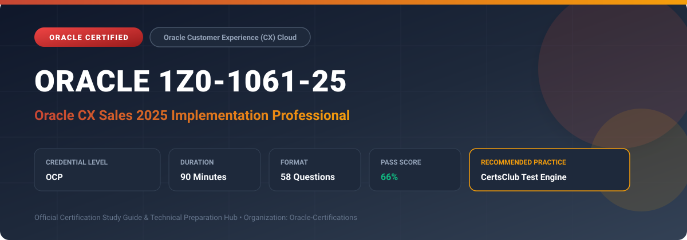

  

# Oracle 1Z0-1061-25: Oracle CX Sales 2025 Implementation Professional

[_Cloud-red?style=for-the-badge)](https://education.oracle.com/)

---

## 1. Exam Overview & Candidate Profile

The **Oracle 1Z0-1061-25: Oracle CX Sales 2025 Implementation Professional** examination is designed for cloud professionals, enterprise architects, implementation consultants, and systems administrators who demonstrate deep practical knowledge and operational competence in deploying, configuring, and optimizing Oracle technologies.

The Oracle CX Sales 2025 Implementation Professional (1Z0-1061-25) exam proves candidate competence in implementing and configuring Oracle CX Sales (formerly Oracle Engagement Cloud / Sales Cloud). Key competencies include lead-to-opportunity lifecycles, forecasting models, territory hierarchies, quota planning, account and contact management, partner relationship management (PRM), and Application Composer extensibility.

### Target Audience & Prerequisites
- **Target Roles**: Implementation Consultants, Cloud Solution Architects, DevOps/SysOps Engineers, and Enterprise Functional Analysts.
- **Recommended Experience**: 1–2 years of hands-on experience in configuring, administering, or implementing the relevant Oracle solutions.
- **Credential Earned**: Oracle Certified Professional (OCP).

---

## 2. Key Exam Specifications

| Specification | Details |
| :--- | :--- |
| **Exam Code** | **Oracle 1Z0-1061-25** |
| **Official Title** | Oracle CX Sales 2025 Implementation Professional |
| **Certification Track** | Oracle Customer Experience (CX) Cloud |
| **Exam Duration** | 90 Minutes |
| **Number of Questions** | 58 Questions |
| **Passing Score** | 66% |
| **Question Format** | Multiple Choice (Single/Multiple Answer), Scenario-Based Questions |
| **Delivery Provider** | Oracle University / Pearson VUE (Online Proctored or Test Center) |
| **Recommended Practice Engine** | [CertsClub Oracle Practice Tests](https://www.certsclub.com/oracle/1z0-1061-25-dumps.html) |

---

## 3. Official Blueprint & Exam Domain Breakdown

The examination assesses candidate competencies across core functional domains weighted as follows:

| Domain Area | Weighting |
| :--- | :--- |
| **Sales Architecture & Initial Setup** | `15%` |
| **Lead & Opportunity Lifecycle Management** | `25%` |
| **Territory Management & Quota Planning** | `20%` |
| **Sales Forecasting & Pipeline Analytics** | `20%` |
| **Extensibility & Groovy Scripting in Application Composer** | `20%` |

---

## 4. Deep Dive into Complex & Challenging Technical Topics

To secure a passing score on the 1Z0-1061-25 exam, candidates must master the following advanced concepts:

- Designing territory dimensions, structural hierarchies, and automated real-time and batch territory assignment rules.
- Configuring multi-dimensional sales forecasting with revenue line item synchronization and territory rollups.
- Implementing complex validation and trigger logic using Groovy scripting in Application Composer.
- Configuring partner portals, deal registrations, and channel partner lifecycle management.

---

## 5. Scenario-Based Demo & Practice Questions

### Question 1
In Oracle CX Sales, what tool allows functional administrators to create custom objects, add custom fields, define object relationships, and write Groovy scripts without touching core code?

A) Page Composer
B) Application Composer
C) Visual Builder Studio
D) Process Composer

- **Correct Answer**: `B) Application Composer`
- **Technical Explanation**: Application Composer is the browser-based configuration tool used by CX Sales administrators to extend standard objects, build custom objects, create fields, and script server-side business logic using Groovy.

---

### Question 2
How does Oracle CX Sales automatically assign sales accounts and leads to sales representatives based on geography and industry?

A) Through Role-Based Access Control policies
B) By running the Territory Assignment Engine with defined territory dimensions
C) Using Workflow notification tasks
D) Via Outlook email integration rules

- **Correct Answer**: `B) By running the Territory Assignment Engine with defined territory dimensions`
- **Technical Explanation**: Territory Management uses defined dimensions (such as Geography, Industry, Auxiliary) and assignment rules to systematically match accounts, contacts, and opportunities with appropriate sales territories and owners.

---

## 6. Recommended Preparation Strategy & Practice Testing Engine

Achieving certification in **Oracle 1Z0-1061-25** requires balanced theoretical study and scenario-based simulation practice:

1. **Review Oracle Documentation**: Master architecture guides, implementation workbooks, and administration manuals on the Oracle Help Center.
2. **Hands-on Lab Practice**: Execute real-world configuration, policy setup, and troubleshooting tasks in your cloud tenancy or test instance.
3. **Simulated Exam Drills**: Practice answering timed, scenario-based multiple-choice questions to familiarize yourself with the question formats, traps, and timing constraints.

### Practice With CertsClub
For realistic practice questions, updated dumps, and mock testing environments:
- **Resource**: [CertsClub Oracle Practice Test Engine](https://www.certsclub.com/oracle/1z0-1061-25-dumps.html)
- **Special Discount**: Use coupon code **`club20`** during checkout for an instant **20% discount** on all practice exam bundles and testing engines.

---

## 7. Official Documentation & References

- [Oracle University Certification Registry](https://education.oracle.com/)
- [Oracle Help Center Documentation Portal](https://docs.oracle.com/)
- [Oracle Cloud Infrastructure & Applications Guides](https://docs.oracle.com/en/cloud/)
- [CertsClub Oracle Certification Exam Practice](https://www.certsclub.com/oracle/1z0-1061-25-dumps.html)

---

## 8. SEO & Discovery Keywords

`oracle 1z0-1061-25`, `oracle 1z0-1061-25 exam`, `oracle 1z0-1061-25 dumps`, `1Z0-1061-25 practice questions`, `1Z0-1061-25 study guide`, `oracle 1z0-1061-25 syllabus`, `oracle cx sales 2025 implementation professional`, `certsclub 1z0-1061-25`